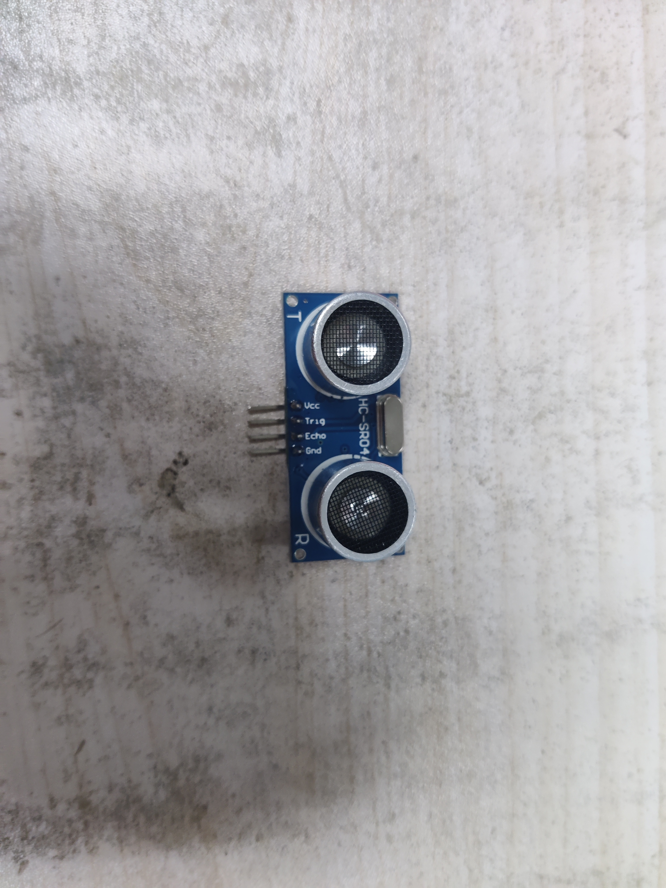
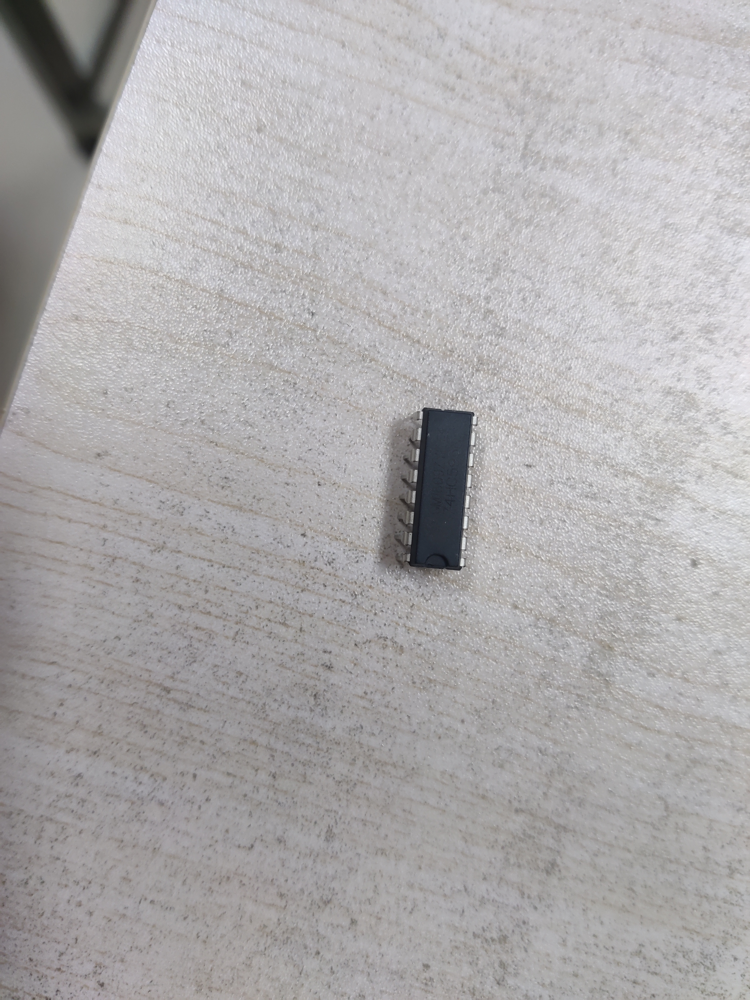
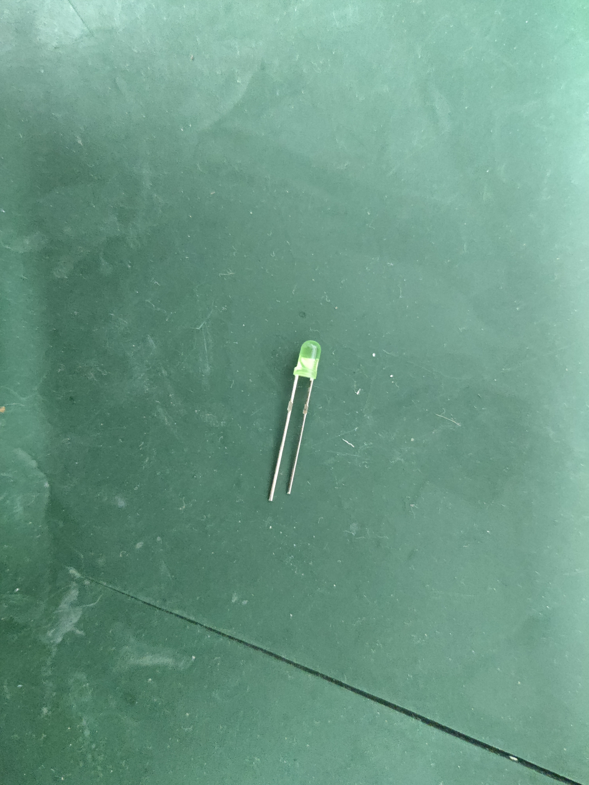

# 第一次考核

## 编程

1. 给你一个数，求最大公因数，用循环
2. 如果我只让你用一个字节的一个变量，存储8位数，请问如何如何把它提取出来这8个数，用循环
3. 给一句英文，例如`how old are you?`，将英文句子首字母大写，句子自己给自己出
4. 输入3个数（没有0），做到将其合成最大的三位整数。例如 5、9、7，输出975
5. scanf输入一个字符串的`ASCII`码，输出其转译后的==字符串==形式

## 学习了解

- 把自己查阅的出处截图，做到筛选

1. GitHub注册，逛一逛（不用交）
2. 了解各种常见的编码格式，如`ASCII`和`utf-8`，要用自己的话理解说明，举例说明
3. 了解电容的分类、作用。要用自己的话理解说明
4. 你们都知道`int main()`
   - 请问`int main(int argc, char ** argv)`加的这俩参数是啥意思

### 看图识物

- 可以借助互联网工具，认识一下这些图，并以自己的理解做出说明

- 解释电路
  - 根据你已有的对二极管的了解，解释一下为什么这个电路可以从交流转变成直流

